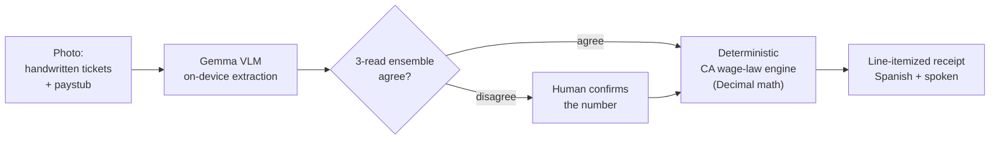
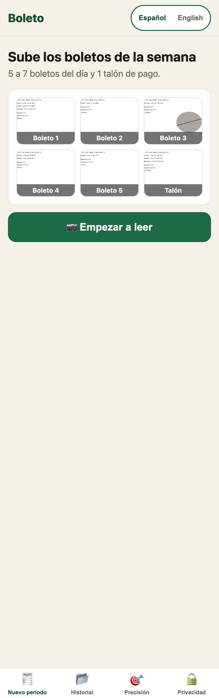
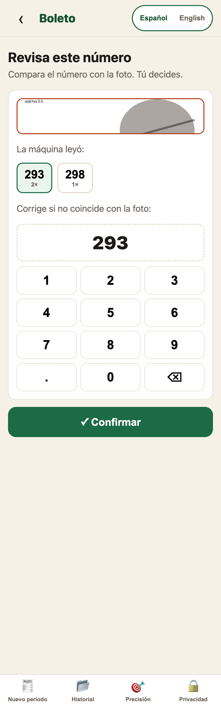
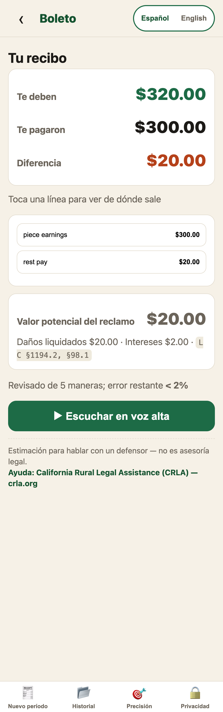
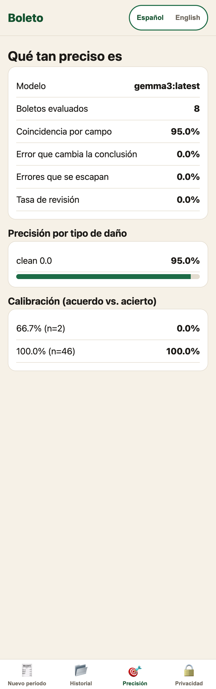

# Boleto

[](https://github.com/kgorle1111/boleto/actions/workflows/ci.yml)
[](LICENSE)

**Stack:** Python 3.12 · FastAPI · vanilla-JS SPA · Gemma (Ollama / MLX) · on-device VLM · SQLite · pytest + Hypothesis

On-device wage audit for California piece-rate farmworkers. Photograph a pay
period's handwritten punch tickets and the printed paystub. A local Gemma model
reads the numbers, a deterministic California-wage-law engine recomputes what is
legally owed, and the app produces a line-itemized receipt read aloud in Spanish.
Nothing leaves the device.

> The AI reads. The law does the math. The human decides.

Piece-rate farmworkers are often underpaid for rest breaks and non-productive time
(California Labor Code §226.2). The people it happens to are usually the least able
to audit a stack of handwritten tickets against a paystub, in English, on a deadline,
without exposing themselves. Boleto does that audit on the worker's own phone, in
Spanish, and produces a receipt they can bring to an advocate.

The model does extraction only. Every number that becomes a legal conclusion goes
through the deterministic engine, where it is unit-tested and auditable. Money is
`Decimal` from end to end, never a float on a legal path. When the model is unsure
about a number, the app stops and asks the person to confirm it, so no unconfirmed
value ever turns into a legal claim.

## Architecture



The only path to a legal number runs through the deterministic engine, and any read
the model is unsure about is gated behind a human. The model never decides; it reads.

## Engineering highlights

- **On-device VLM extraction.** Gemma reads handwritten numbers locally, through Ollama
  (Gemma 3) or MLX (Gemma 4 E4B). No image, no data, no dependency on the network.
- **A calibrated review gate.** Each number is read three times. Agreement is trusted,
  disagreement is routed to a human. Measured on real tickets: when the reads agree the
  model is right every time (46/46); when they disagree it is wrong every time (0/2). The
  gate catches exactly the errors that matter, and nothing else.
- **A deterministic wage engine.** Every legally meaningful number is recomputed in pure
  Python with `Decimal` (never a float on a money path), verified against 6 golden
  known-answer cases plus Hypothesis property tests.
- **Adversarial QA.** Eight code-review, critic, and security findings were found and
  fixed, each pinned by a regression test (46 tests total, green in CI on the mock
  backend so it needs no GPU).
- **A negative result, on purpose.** I fine-tuned four LoRA adapters on Gemma 4 E4B to push
  handwriting accuracy; the eval rejected every one before it could ship, and the model that
  actually ships is stock Gemma 3. The reliability comes from the system around the model
  (ensemble, deterministic engine, human gate), not from a bigger or fine-tuned one. Details
  in [results/FINAL-REPORT.md](results/FINAL-REPORT.md).

## Screenshots

| Capture | Review gate | Receipt |
|---|---|---|
|  |  |  |
| Photograph the week's tickets and paystub | The model read a smudged number two ways (293 twice, 298 once), so it asks the person to decide | What is owed, line by line, with statute citations and a spoken-Spanish playback |

The app also shows its own measured accuracy, including the calibration that decides
when to ask the human:



## Accuracy

The review gate is calibrated, not cosmetic. Measured on 8 real printed tickets with
Gemma 3 running locally through Ollama:

- 0% escaped-error rate (the ship bar is 5% or lower), and 0% wrong legal conclusions.
- 95% of fields read exactly right, at about 5 seconds per ticket, all on device.
- When the three-read ensemble agrees, it is right every time (46 of 46). When the
  reads disagree, it is wrong every time (0 of 2). So the app sends disagreement to
  the human. The two reads the model got wrong are the two it flagged for review.

This is the printed ticket set (n=8). Real handwriting is the next measurement and is
not done yet. The full verdict, the error budget, and the open problems are in
[results/FINAL-REPORT.md](results/FINAL-REPORT.md).

## Run it (clean clone)

```bash
# 1. Python env and deps (Python 3.12+)
python3 -m venv .venv && source .venv/bin/activate
pip install -e .

# 2. GPU-free path: proves the whole pipeline with a mock reader, no model needed
python wage_engine.py     # deterministic engine, 6 golden known-answer cases
pytest -q                 # full suite (46 tests)
python -m uvicorn app.server:app --host 127.0.0.1 --port 8010   # open http://127.0.0.1:8010

# 3. Real on-device model (optional). Two backends work:
#    a) Gemma 3 vision via Ollama (the numbers above):
ollama pull gemma3:latest
BOLETO_MODEL=gemma3:latest python -m evals.run_eval --source real --engine ws-a
#    b) Gemma 4 E4B via MLX (Apple Silicon), also fully offline:
BOLETO_MODEL=mlx python -m evals.run_eval --source real --engine ws-a
```

The default backend is `mock`, which reads ground truth so the UI and engine behave
the same without a GPU. `BOLETO_MODEL=gemma3:latest` runs Gemma 3 through Ollama;
`BOLETO_MODEL=mlx` runs Gemma 4 E4B locally. To run the app on a real model, set
`BOLETO_ADAPTER=real` with the same `BOLETO_MODEL`. The server binds to `127.0.0.1`
only, so it keeps working with Wi-Fi off.

## Layout

| Path | What |
|---|---|
| `wage_engine.py` | Reference deterministic engine (6 golden known-answer cases) |
| `core/wage_engine/` | `audit_session()`, statute citations, claim value, hash-chained sqlite history |
| `core/contracts.py` | Frozen data contracts every component shares |
| `core/model_client.py` | The one entry point to the local model (Gemma 4 E4B via MLX, Gemma 3 via Ollama, or the mock) |
| `extraction/` | Per-field crop, self-consistency ensemble, quality gate, dedup, checksum, reconcile |
| `evals/` | Synthetic-handwriting generator, degradation suite, scorer, calibration, `run_eval.py` |
| `app/` | FastAPI and a vanilla-JS SPA: capture, review (the human gate), receipt, Spanish TTS |
| `demo_session/` | Prepared pay period including one smudged ticket that triggers review |
| `results/FINAL-REPORT.md` | The eval verdict, error budget, adversarial-QA findings, and open problems |

## Honest status

Hackathon build. The extraction pipeline, wage engine, eval harness, and app were
built against frozen contracts, integrated, and adversarially reviewed (8 findings
found and fixed, each with a regression test). It passes the ship bar on everything
measurable today: printed tickets, real model, 0 escaped errors. What it does not yet
have is real consented handwritten tickets, counsel-reviewed statute wording, and a
verified 2026 minimum-wage figure. Those are steps for a real rollout, not gaps in the
demo. Design decisions and rejected alternatives are in [tradeoffs.md](tradeoffs.md).

*Not legal advice. This is an estimate to bring to an advocate. Help in California:
California Rural Legal Assistance (CRLA), crla.org.*
