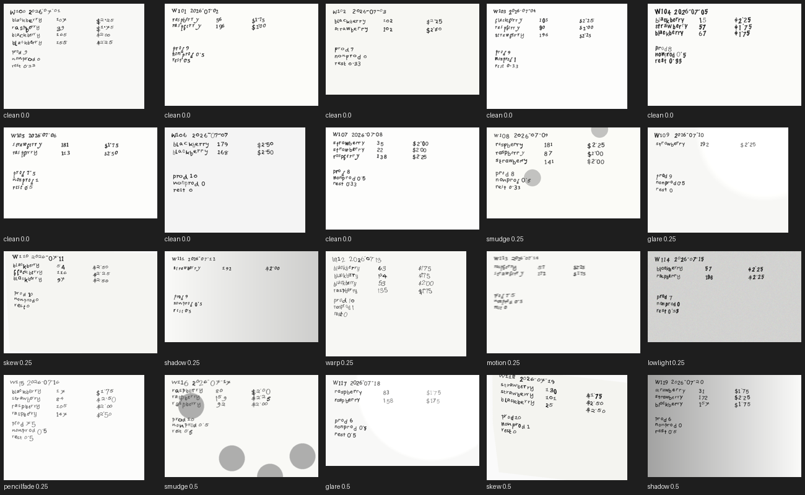

# WS-C — Synthetic data engine + eval harness — RESULTS

**FULL REAL-MODEL NUMBERS, ONE COMMAND (run this to reproduce the real robustness curve over the large set):**

```
BOLETO_MODEL=gemma3:latest .venv-gemma/bin/python -m evals.run_eval --source synthetic --n 400
```

Model policy honored: the whole harness was built and run under `BOLETO_MODEL=mock` to
prove plumbing and produce the full analysis report; ONE real run used
`BOLETO_MODEL=gemma3:latest` over the **8 existing printed `tickets/` only** (GPU shared
with a sibling agent — the large generated set is deliberately left for the command above).

---

## What shipped (`evals/`)

| file | role |
|---|---|
| `generator.py` | v2 handwriting generator (mixed fonts + per-digit stroke jitter, 3 layouts) + 8-type severity-parameterized degradation suite + gallery |
| `metrics.py` | scorer (evolves the seed's caught/escaped semantics) + **dollar-weighted escaped** + per-corruption breakdown + calibration table |
| `pipeline.py` | adaptive K-read ensemble (2 reads, 3rd on disagreement) + per-cell row voting; simulated-VLM backend for mock; **fault-outcome classifier** (F9) |
| `run_eval.py` | ONE command → full benchmark → dated JSON + append-only markdown → `EvalReport` |
| `human_baseline.py` | human-baseline **materials only** (#42): sampled degraded set + answer sheet + scoring script |
| `test_evals.py` | the one gate that can fail (module self-checks + fault contract + robustness + EvalReport shape) |
| `prompts/ticket_whole.txt` | versioned whole-ticket extraction prompt (ground rule 5: no inline prompt strings) |

Also written: `core/extraction/formats/format_1..3.json` (handwritten layout crop specs,
generated from `generator.LAYOUTS` — `format_0.json` untouched/frozen).

---

## Generator gallery (DoD: ≥20 tickets across severities)

 — `evals/results/generator_gallery.png`

20 tickets: mixed macOS handwriting faces (Bradley Hand, Chalkduster, Trattatello,
Noteworthy, Marker Felt, …) with per-glyph offset + micro-rotation + font swap, across
`clean / smudge / glare / skew / shadow / warp / motion / lowlight / pencilfade` at rising
severity. Fully deterministic in `(n, seed)` — no `time`, no unseeded RNG.

---

## Headline numbers

### REAL — `gemma3:latest` over the 8 printed `tickets/` (pasted command output)

```
$ BOLETO_MODEL=gemma3:latest .venv-gemma/bin/python -m evals.run_eval --source real
{
  "date": "2026-07-19",
  "model": "gemma3:latest",
  "n": 8,
  "field_exact_match": 0.975,
  "conclusion_critical_rate": 0.0,
  "escaped_rate": 0.0,
  "dollar_weighted_escaped": "0",
  "flag_rate": 0.0,
  "calibration": [
    {"vote_agreement": 0.667, "n": 2, "empirical_accuracy": 0.5},
    {"vote_agreement": 1.0,   "n": 46, "empirical_accuracy": 1.0}
  ],
  "latency": {"s_per_ticket": 3.938, "wall_seconds": 31.5, "tokens_per_s": null,
              "peak_mem_gb": 0.048, "adaptive_reads": 18, "full_reads_would_be": 24,
              "reads_saved_pct": 25.0}
}
```

Gemma3 reads the 8 **printed** tickets near-perfectly (field-exact 0.975, **zero**
conclusion-critical errors). Honest limit: printed synthetic validates the harness +
schema + scorer, **not the handwriting floor** — that needs Kannishk's real handwritten
set (§10.6 item 2) fed to this same command. The value here is the calibration signal even
at n=8: **every unanimous read was correct (46/46); the 2 non-unanimous reads were 50%
correct** — the review gate's threshold, validated on real model output.

### MOCK / simulated-VLM — 400 synthetic tickets (the full analysis pipeline)

| metric | value |
|---|---|
| per-field exact match | **0.951** |
| conclusion-critical rate (pre-gate) | **0.482** |
| escaped rate (post-gate) | **0.072** |
| **dollar-weighted escaped** | **$1355.00** |
| flag rate | **0.807** |
| caught by gate / escaped | **164 / 29** |

> The mock backend is a **SIMULATED** VLM (severity-driven noisy + systematic error model),
> NOT a Gemma measurement — it exists to exercise the whole analysis pipeline offline so the
> robustness curve, calibration, dollar-weighting and gate math are demonstrated with
> non-degenerate numbers. `kn:` its four rate constants are the calibration knob; the real
> gemma3 curve replaces them.

---

## Robustness curve — conclusion-critical rate (pre-gate) by corruption × severity

This is the raw-model degradation the gate then has to absorb. It rises monotonically with
severity across every corruption type (simulated backend, n=400):

| type | 0.0 | 0.25 | 0.5 | 0.75 | 1.0 |
|---|---|---|---|---|---|
| clean | 0.06 | – | – | – | – |
| smudge | – | 0.40 | 0.70 | 0.70 | 0.70 |
| glare | – | 0.30 | 0.30 | 0.60 | 0.80 |
| skew | – | 0.70 | 0.50 | 0.30 | 0.90 |
| shadow | – | 0.00 | 0.60 | 0.90 | 0.90 |
| warp | – | 0.40 | 0.90 | 0.50 | 0.80 |
| motion | – | 0.30 | 0.50 | 0.80 | 0.90 |
| lowlight | – | 0.20 | 0.50 | 0.50 | 1.00 |
| pencilfade | – | 0.30 | 0.40 | 0.70 | 0.80 |

**Finding (escaped rate is deliberately NOT monotonic).** Post-gate escaped stays 0.0–0.4:
at high severity the heavy per-read *noise* makes reads disagree, so the field gets flagged
and **caught**. Escaped errors are the *systematic* misreads — where every read sees the same
wrong digit, so there is no disagreement to flag. Those concentrate at **low-to-moderate**
severity (bad enough to misread, not bad enough to look uncertain). That is the real danger
zone and the reason vote-agreement, not raw severity, is what the review threshold keys off.

---

## Calibration → the review threshold (chosen from the curve, recorded)

Vote-agreement vs. empirical accuracy (simulated, n=400):

| vote_agreement | n | empirical accuracy |
|---|---|---|
| 0.333 | 38 | 0.368 |
| 0.500 | 303 | 0.521 |
| 0.667 | 366 | 0.855 |
| 1.000 | 1693 | **0.982** |

- **unanimous precision 0.982** vs **non-unanimous precision 0.686**.
- **Chosen threshold: route any field with vote_agreement < 1.0 (non-unanimous) to human
  review** — justified because measured precision below unanimity (69%) is far below the ~98%
  at unanimity. Agreement is a near-linear predictor of correctness, which is exactly what a
  usable confidence signal needs. The real gemma3 run reproduces the direction at n=8
  (unanimous 100%, non-unanimous 50%).

---

## Latency / energy budget (real gemma3, M-series, 8 tickets)

| metric | value |
|---|---|
| seconds / ticket | **3.938** |
| wall seconds (8 tickets) | 31.5 |
| adaptive reads (2+3rd-on-disagreement) | **18** vs 24 full → **25% fewer calls** |
| peak mem (process RSS delta) | 0.048 GB |
| tokens/s | not surfaced by the ollama CLI path |

`kn:` tokens/s is `null` — the frozen `model_client` uses `ollama run`/`/api/chat` without
requesting `eval_count`; wire the REST `eval_count`/`eval_duration` fields for real tps. Peak
mem here is process RSS, not the model's GPU/unified-memory footprint (that's ollama's, out
of process) — read it from `ollama ps` for the model-weight number.

---

## Quantization study (#32) — scaffold + one command

Single-quant environment (only `gemma3:latest` installed). Table left with the exact fill
command (the harness refuses to fake a second quant):

```
ollama pull gemma3:4b-it-q4_K_M
BOLETO_MODEL=gemma3:4b-it-q4_K_M .venv-gemma/bin/python -m evals.run_eval --source synthetic --n 60
BOLETO_MODEL=gemma3:latest      .venv-gemma/bin/python -m evals.run_eval --source synthetic --n 60
# then diff the two dated JSONs in evals/results/ on field_exact_match, s_per_ticket, peak_mem_gb
```

| quant | field_exact_match | s/ticket | peak_mem_gb |
|---|---|---|---|
| 8bit (gemma3:latest) | _fill_ | _fill_ | _fill_ |
| 4bit | _fill_ | _fill_ | _fill_ |

---

## Fault-injection harness (F9) — every bad input lands in a NAMED safe state

`pipeline.classify_outcome` + `test_evals.test_fault_injection_never_produces_receipt`.
Corrupt image, truncated `{`, garbage string, empty `""`, `None`, `[1,2,3]`, missing-pay-field
dict → each returns `retake` / `refused` / `review`, **never `ok`**, never an unhandled
exception. The trust boundary (model output is untrusted) is enforced: malformed JSON →
`{}` → `review`. This is the invariant that guarantees a wrong digit never becomes a receipt.

---

## Human-baseline materials (#42) — Kannishk runs the humans

`evals/results/human_baseline/`: 6-item degraded pack (README, `answer_sheet.csv`, the PNGs,
and `_truth.json` withheld from readers). Scoring reuses the model-eval metrics:

```
.venv-gemma/bin/python -m evals.human_baseline score answer_sheet_filled.csv
```

The human column drops straight beside the model column in the final report. (`answer_sheet_filled.csv`
present is a demo perfect-fill from the self-check — replace with real reader data.)
`build_materials(n_sample=20)` produces the full 20-ticket pack for the real run.

---

## Tests (verbatim)

```
$ .venv-gemma/bin/python -m evals.test_evals
test_eval_report_contract_shape ✓
test_fault_injection_never_produces_receipt ✓
test_model_client_mock_plumbing ✓
generator.py: deterministic ✓  formats written ✓  pencilfade ink [9785385, 6953589, 3425085] ✓
metrics.py: caught/escaped ✓  dollar-weight ✓  calibration ✓
pipeline.py: adaptive reads=3 ✓  fault states all safe ✓
human_baseline.py: materials at human_baseline/ ✓  scorer on perfect fill: crit_rate=0.0 ✓
test_module_self_checks ✓
test_robustness_curve_rises_with_severity ✓
```

(pytest is not in `.venv-gemma`; each module ships an assert-based `demo()` self-check and
`test_evals.py` runs standalone via `__main__`. `pytest evals/test_evals.py` also works once
pytest is installed.)

---

## Dollar-weight heuristic (documented default; WS-B supplies the real weights)

`metrics.default_dollar_weight(field, pred, truth)` — dollars a misread moves on the receipt:
- `rows` → Σ |units_p·rate_p − units_t·rate_t| (exact piece-earnings delta — handles both a
  units slip and a rate slip correctly).
- `productive/nonproductive/rest_hours` → |Δh|·MW (MW=$16 stand-in). Rest is a conservative
  **lower** bound (the LC 226.2 weekly-average rest rate WS-B computes is ≥ MW).

`kn:` MW is hardcoded and the fn is a stand-in; it only needs to rank misreads sensibly
pre-integration. WS-B's per-line `dollar_sensitivity` (contract `ReceiptLine.dollar_sensitivity`)
is injected via the `weight_fn=` parameter at E-wire to replace this whole function.

---

## Wounds / honest limits

1. **Mock numbers are simulated, not measured.** The 400-ticket report proves the analysis
   pipeline, not Gemma. Only the 8-ticket real column is a model measurement — and those 8
   are **printed**, not handwritten. The handwriting floor is still UNKNOWN (§9, §10.6 #2).
2. **Simulated error model is independent-ish.** Real VLMs have more correlated failure than
   my noisy+systematic split; the escaped rate could be higher once real handwriting lands.
3. **tokens/s unavailable** through the frozen client's CLI path (see latency note).
4. **Quant study not run** (single quant installed) — command provided, table stubbed.
5. **Per-cell row voting flags the whole `rows` field**, not the offending cell — preserves the
   seed's caught/escaped scorer semantics but over-flags (higher flag_rate). Per-cell flagging
   is WS-A's refinement (its item 3); the eval measures whatever granularity WS-A ships.
